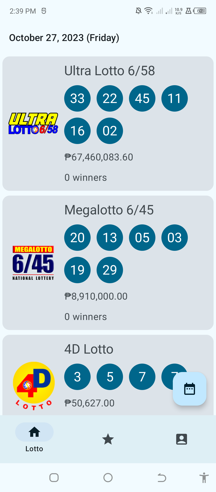
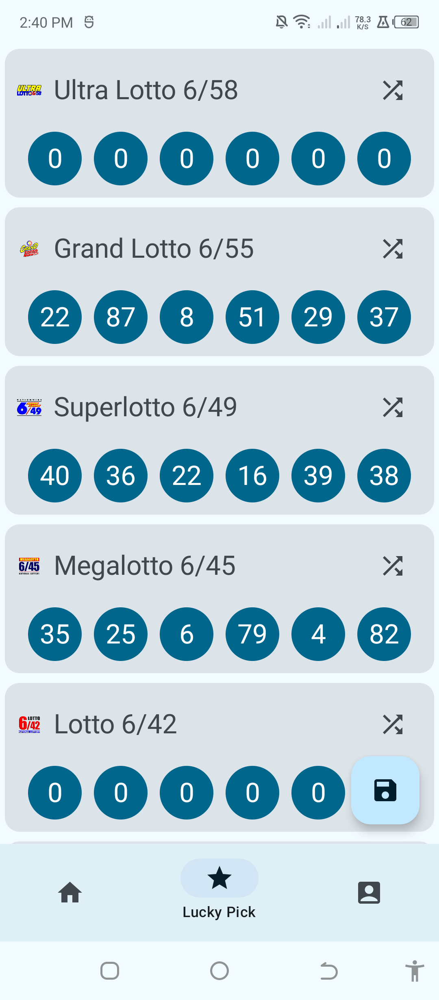

# Active in development
I'm currently working on this one. I had an old app before that can show Lotto Results but written in Java with MVP design pattern. I fell in love with Kotlin and Jetpack Compose. Thankfully I got some cool APIs for PCSO Lotto. No more scraping:) Hey, can you leave 1 star? Thanks

# Images

